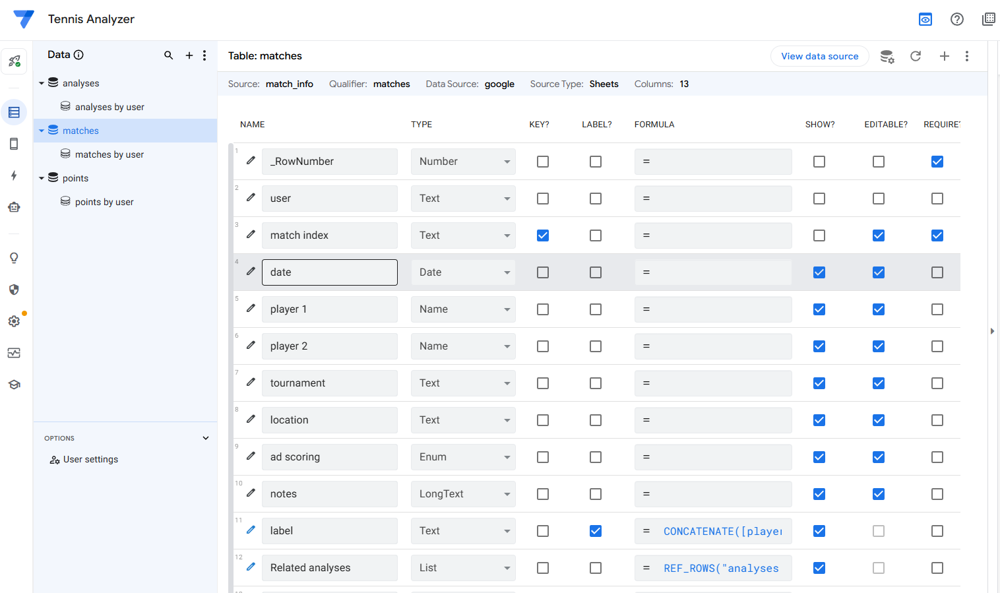
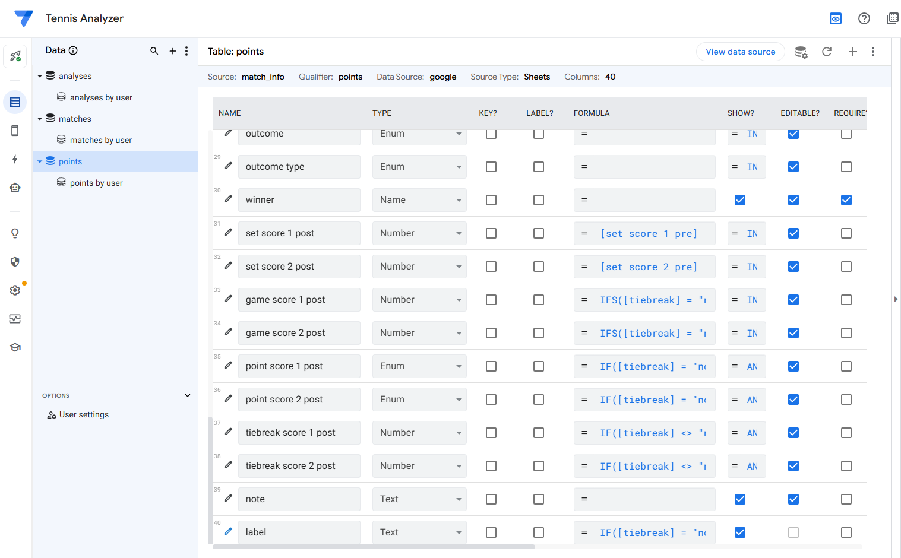
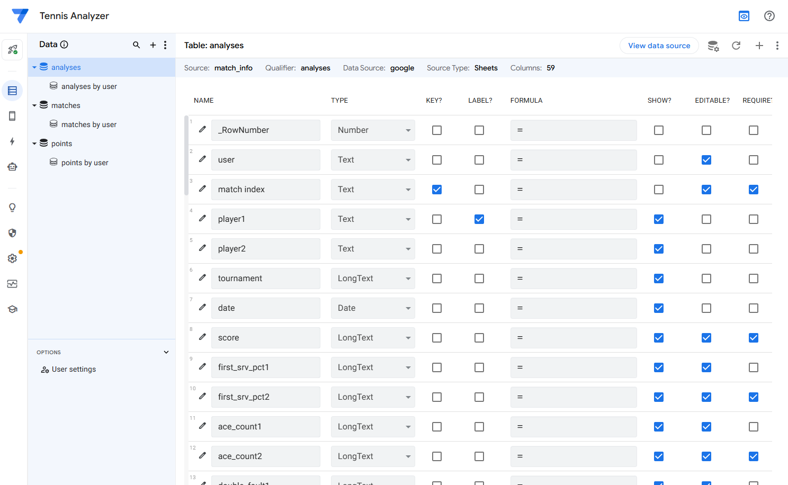
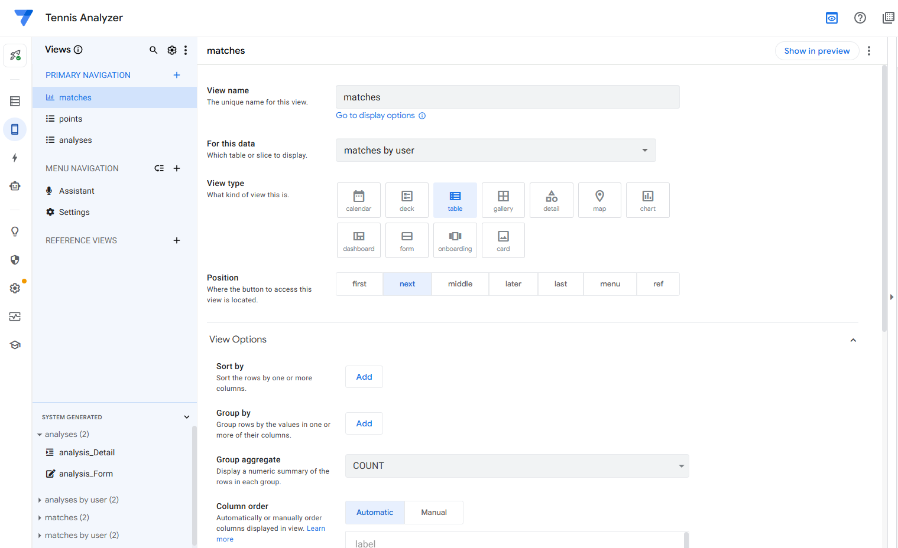
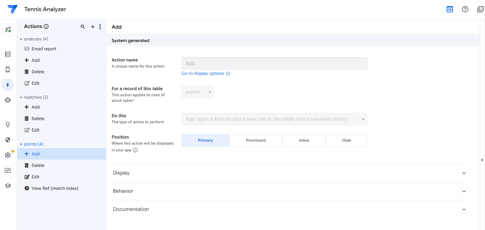
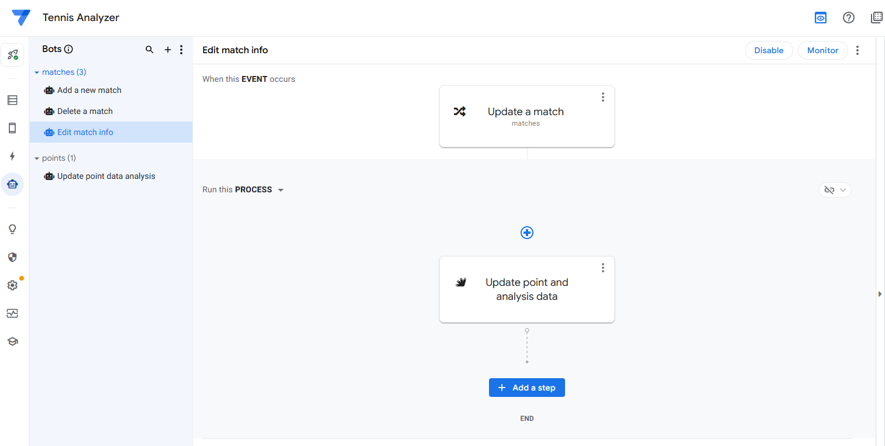

# AppSheet Frontend Documentation

This document outlines the front-end design and user interface structure of the Tennis Analyzer application, built on the AppSheet platform. The app is designed to track tennis match progress, record point-by-point data, and send the data to the backend. The backend performs statistical analyses and sends the results back to the frontend for display.

The frontend is built using Google AppSheet. Because AppSheet is a web-based, low-code platform, there is no source code in this folder. The backend is built using Google Sheets and Google Apps Script (built on JavaScript).

### Data Tables

An AppSheet application is built on data tables. There are three data tables in this application:
- Matches
- Points
- Analyses

### Views
Views are the main interface for users to interact with the application. There are three views in this application:
- Matches (for managing matches)
- Points (for managing point-by-point data)
- Analyses (for viewing analysis results)

### Actions
Each view has three standard actions: 
- Add
- Edit
- Delete 

The Analysis view has a custom action "EmailReport" that sends the analysis by email.

### Bots
Bots are the automation that runs in the background to perform tasks. There are two bots in this application:
- Add a new match --> Add new analysis
- Delete a match --> Delete analysis
- Edit match information --> Update point data analysis
- Add, delete, or edit point data --> Update point data analysis

To learn how to use this app, please visit the [project website](https://www.tennisanalyzer.app/), where you can find a video tutorial, FAQ document, and sample tennis match analysis reports.

